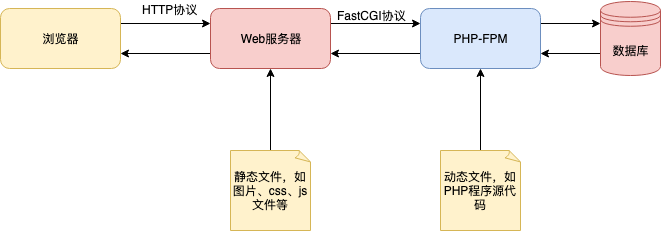
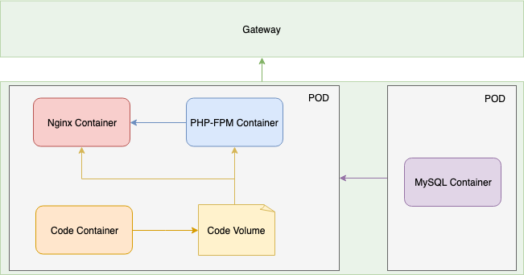
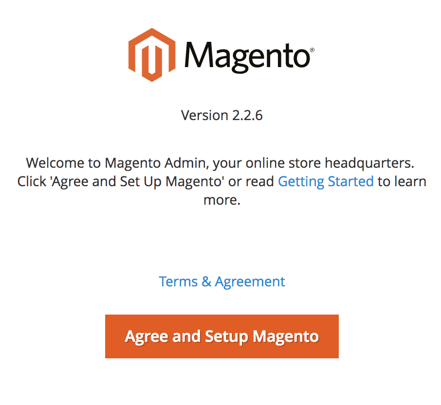

# magento-to-kubernetes

- [magento-to-kubernetes](#magento-to-kubernetes)
  * [前言](#前言)
    + [基本要求](#基本要求)
    + [先决条件](#先决条件)
    + [可选条件](#可选条件)
  * [方案设计](#方案设计)
    + [工作流程](#工作流程)
    + [架构设计](#架构设计)
  * [方案详情](#方案详情)
    + [准备Nginx配置](#准备Nginx配置)
    + [部署Magento服务](#部署Magento服务)
      - [构建Magento镜像](#构建Magento镜像)
      - [部署Magento应用](#部署Magento应用)
      - [暴露Magento端口](#暴露Magento端口)
    + [部署MySQL数据库](#部署MySQL数据库)
      - [存储敏感数据](#存储敏感数据)
      - [部署MySQL应用](#部署MySQL应用)
      - [暴露MySQL端口](#暴露MySQL端口)
    + [网关配置](#网关配置)
    + [初始化项目](#初始化项目)

## 前言
[Magento](https://magento.com)是一款国外流行的，基于PHP实现的电子商务平台，任何人都可以使用它免费地创建自己的在线商店。本教程将展示如何将Magento容器化并在Kubernetes上运行。

### 基本要求
- 对Nginx语法的基本了解
- 对PHP工作流程的基本了解
- 对Dockerfile指令的基本了解
- 对Kubernetes对象的基本了解


### 先决条件
- 拥有DockerHub账号，用于存放Docker镜像
- 拥有Kubernetes集群，用于编排容器和部署应用

### 可选条件
- 集群部署Istio组件，本教程仅使用Istio功能中的网关服务（没有安装Istio也可以通过ip:port的形式访问应用）

## 方案设计

### 工作流程
> 要运行PHP应用程序，首先需要理解Nginx与PHP-FPM的工作机制

对于静态文件，作为Web服务器的Nginx可以直接处理； 当涉及到动态文件，Nginx会启动PHP解析器，解析器按照指定的协议如FastCGI，将处理后的结果按照格式返回，而PHP-FPM就是FastCGI协议的实现。

整个Web请求简单地概览如下：



### 架构设计
我们来看一下整个项目的架构设计，如图：



其中各个模块的作用如下：
- Gateway：网关，对外暴露端口提供服务
- Nginx Container：Nginx容器，作为Magento项目的Web服务器
- PHP-FPM Container：PHP-FPM容器，作为Magento项目的PHP解析器
- Code Container：代码容器，存放Magento项目代码
- Code Volume：代码存储卷，为Nginx容器和PHP-FPM容器提供代码文件
- MySQL Container：MySQL容器，为Magento项目提供数据存储能力

上图为了清晰地展示架构，将项目代码放在Code Container中，但在实际的工作中，我们其实可以将项目代码文件放入Nginx Container或者PHP-FPM Container中，减少打包构建工作。

## 方案详情

### 准备Nginx配置
我们使用Magento官方提供的magento-cloud-docker-nginx作为我们的nginx镜像，但是配置还是需要提供的，包括nginx.conf和vhost.conf两个文件，我们都放在configmap中，详情请参考[nginx configmap yaml](/deploy/nginx/configmap.yaml)

关于Nginx配置不做过多解释，这里需要强调的是如果是在Web端初始化Magento项目，setup的配置不可缺，即注意以下内容：
```yaml
location ~* ^/setup($|/) {
  root $MAGE_ROOT;
  location ~ ^/setup/index.php {
    fastcgi_pass   $my_fastcgi_pass;

    fastcgi_param  PHP_FLAG  "session.auto_start=off \n suhosin.session.cryptua=off";
    fastcgi_param  PHP_VALUE "memory_limit=756M \n max_execution_time=600";
    fastcgi_read_timeout 600s;
    fastcgi_connect_timeout 600s;

    fastcgi_index  index.php;
    fastcgi_param  SCRIPT_FILENAME  $document_root$fastcgi_script_name;
    include        fastcgi_params;
  }

  location ~ ^/setup/(?!pub/). {
    deny all;
  }

  location ~ ^/setup/pub/ {
    add_header X-Frame-Options "SAMEORIGIN";
  }
}
```
执行以下命令创建configmap：
```shell
kubectl apply -f deploy/nginx/configmap.yaml
```

### 部署Magento服务

#### 构建Magento镜像

我们在这里为了方便起见，采用Magento官方提供的fpm镜像，并将Magento项目代码和fpm打包在同一个镜像中，镜像构建文件Dockerfile如下：

```dockerfile
FROM magento/magento-cloud-docker-php:7.2-fpm
# 设置项目内存限制
ENV PHP_MEMORY_LIMIT 2G
# 设置Magento工作目录
ENV MAGENTO_ROOT /magento
# 设置Magento项目版本
ARG MAGENTO_VERSION=2.3.2-p2

# 设置php.ini参数
RUN sed -i "s/!PHP_MEMORY_LIMIT!/${PHP_MEMORY_LIMIT}/" /usr/local/etc/php/conf.d/zz-magento.ini 

# 拉取Magento项目代码和Sample数据
RUN wget -q "https://github.com/magento/magento2/archive/${MAGENTO_VERSION}.tar.gz" -O "/tmp/magento.tar.gz"
RUN wget -q "https://github.com/magento/magento2-sample-data/archive/${MAGENTO_VERSION}.tar.gz" -O "/tmp/magento-sample.tar.gz"

# 解压并删除压缩包
RUN tar xzf /tmp/magento.tar.gz -C /var/www/ \
  && mv "/var/www/magento2-$MAGENTO_VERSION" /var/www/magento \
  && tar xzf /tmp/magento-sample.tar.gz -C /var/www/magento/ magento2-sample-data-$MAGENTO_VERSION/ \
  && cp -rp /var/www/magento/magento2-sample-data-$MAGENTO_VERSION/* /var/www/magento \
  && rm -rf /var/www/magento/magento2-sample-data-$MAGENTO_VERSION \
  && rm /tmp/magento-sample.tar.gz \
  && rm /tmp/magento.tar.gz

# 安装composer
RUN curl -sS https://getcomposer.org/installer | php -dmemory_limit=-1 -- --install-dir=/usr/local/bin --filename=composer
# 安装项目依赖
RUN cd /var/www/magento && /usr/local/bin/composer install

# 设置用户与分组
RUN echo "user = www-data" >> /usr/local/etc/php-fpm.conf
RUN echo "group = www-data" >> /usr/local/etc/php-fpm.conf

COPY start.sh start.sh
RUN chmod +x start.sh
CMD ["sh", "start.sh"]  
```
为了能让后续Kubernetes提供挂载能力，将项目拷贝到挂载文件夹，故将以下内容放置start.sh脚本中，内容如下：
```shell
#!/bin/bash
mkdir -p /magento
# 将Magento项目文件拷贝到挂载文件夹中
cp -a /var/www/magento/* /magento
# 授权
chown -R www-data:www-data /magento
# 启动php-fpm
php-fpm -F
```
**注意这个/magento文件夹，就是我们上图中提到的Code Volume，后续还会再强调**

使用Docker进行打包和并将镜像推送到仓库中，命令如下：
```shell
docker build -t magento:latest build/
docker tag magento:latest <your_docker_register_path>:<tag>
docker push <your_docker_register_path>:<tag>
```

#### 部署Magento应用

我们将PHP-FMP镜像和Nginx镜像部署在同一个POD中，挂载Nginx配置和共享文件夹，内容如下：
```yaml
apiVersion: apps/v1
kind: Deployment
metadata:
  name: magento-app
  namespace: magento
  labels:
    app: magento-app
spec:
  replicas: 1
  selector:
    matchLabels:
      app: magento-app
  template:
    metadata:
      labels:
        app: magento-app
    spec:
      containers:
      - name: magento-app
        image: <your_magento_image>
        volumeMounts:
        - name: magento-app-stroage
          mountPath: /magento
      - name: magento-nginx
        image: magento/magento-cloud-docker-nginx
        ports:
        - containerPort: 80
        volumeMounts:
        - name: magento-nginx-config
          mountPath: /etc/nginx/nginx.conf
          subPath: nginx.conf
        - name: magento-nginx-config
          mountPath: /etc/nginx/conf.d/default.conf
          subPath: vhost.conf
        - name: magento-app-stroage
          mountPath: /magento
      volumes:
      - name: magento-app-stroage
        emptyDir: {}
      - name: magento-nginx-config
        configMap:
          name: magento-nginx-config
```
这里我们使用Kubernetes Volumes中的emptyDir作为挂载卷，并将/magento设置为挂载的路径。emptyDir存储卷虽然不具备数据的持久存储，但非常适合Pod中多个容器共享文件的这种场景。

执行以下命令部署应用：
```shell
kubectl apply -f deploy/magento/deployment.yaml
```

#### 暴露Magento端口
```yaml
apiVersion: v1
kind: Service
metadata:
  name: magento-app
  namespace: magento
  labels:
    app: magento-app
spec:
  selector:
    app: magento-app
  ports:
  - name: magento-nginx-port
    port: 80
    protocol: TCP
  type: NodePort
```
执行以下命令部署应用：
```shell
kubectl apply -f deploy/magento/service.yaml
```

### 部署MySQL数据库
> 如果你已经有MySQL数据库并且能提供服务的话，可以跳过该节

#### 存储敏感数据
将MySQL的敏感信息存储于secret对象中，stringData参数包含在创建或更新期间自动编码的未编码数据，并且在检索Secrets时不输出数据，内容如下：

```yaml
apiVersion: v1
kind: Secret
metadata: 
name: magento-mysql-secret
namespace: magento
type: Opaque
stringData: 
  MYSQL_USER: magento-user
  MYSQL_PASSWORD: magento-password
  MYSQL_DATABASE: magento-databse
  MYSQL_ROOT_PASSWORD: magento-root-password
```
执行以下命令创建secrtet对象：
```shell
kubectl apply -f deploy/mysql/secret.yaml
```

#### 部署MySQL应用
我们选取mysql:5.6作为镜像，将MySQL的敏感数据作为变量注入，挂载外部卷作为数据的存储位置并设置POD使用资源的上下限，内容如下：

```yaml
apiVersion: apps/v1
kind: Deployment
metadata: 
  name: magento-mysql
  namespace: magento
spec:
  selector:
    matchLabels:
      app: magento-mysql
  template:
    metadata:
      labels:
        app: magento-mysql
    spec:
      containers:
      - name: magento-mysql
        image: mysql:5.6
        ports:
        - name: default-port
          containerPort: 3306
        args: ["--character-set-server=utf8mb4", "--collation-server=utf8mb4_unicode_ci"]
        env:
        - name: MYSQL_DATABASE
          valueFrom:
            secretKeyRef:
              key: MYSQL_DATABASE
              name: magento-mysql-secret
        - name: MYSQL_USER
          valueFrom:
            secretKeyRef:
              key: MYSQL_USER
              name: magento-mysql-secret
        - name: MYSQL_PASSWORD
          valueFrom:
            secretKeyRef:
              key: MYSQL_PASSWORD
              name: magento-mysql-secret
        - name: MYSQL_ROOT_PASSWORD
          valueFrom:
            secretKeyRef:
              key: MYSQL_ROOT_PASSWORD
              name: magento-mysql-secret
        resources:
          requests:
            cpu: 100m
            memory: 200Mi
          limits:
            cpu: 1000m
            memory: 2000Mi
        volumeMounts:
        - name: magento-mysql-storage
          mountPath: /var/lib/mysql
      volumes:
      - name: magento-mysql-storage
        persistentVolumeClaim:
          claimName: magento-mysql-pvc
```
执行以下命令部署MySQL应用：
```shell
kubectl apply -f deploy/mysql/deploy.yaml
```

#### 暴露MySQL端口
我们暴露3306端口以供外部使用，内容如下：
```yaml
apiVersion: v1
kind: Service
metadata:
  name: magento-mysql-service
  namespace: magento
  labels:
    app: magento-mysql
spec:
  selector:
    app: magento-mysql
  ports: 
  - name: default-port
    port: 3306
    protocol: TCP
  type: NodePort
```
执行以下命令暴露MySQL端口：
```shell
kubectl apply -f deploy/mysql/service.yaml
```

### 网关配置

> 如果你的集群没有安装Istio组件，可以跳过该节

假如你自定义的域名是**your_sample.com**，你希望它能指向你的Magento应用，则需要配置Istio Gateway和Istio VirtualService文件，内容如下：

```yaml
apiVersion: networking.istio.io/v1alpha3
kind: Gateway
metadata:
  name: magento-app-gateway
  namespace: magento
spec:
  selector:
    istio: ingressgateway
  servers:
  - port:
      number: 80
      name: http
      protocol: HTTP
    hosts:
    - "your_sample.com"
---
apiVersion: networking.istio.io/v1alpha3
kind: DestinationRule
metadata:
  name: magento-app
  namespace: magento
spec:
  host: magento-app
  trafficPolicy:
    connectionPool:
      tcp:
        maxConnections: 2048
      http:
        idleTimeout: 6m
        http1MaxPendingRequests: 2048
---
apiVersion: networking.istio.io/v1alpha3
kind: VirtualService
metadata:
  name: magento-app
  namespace: magento
spec:
  hosts:
  - "your_sample.com"
  gateways:
  - magento-app-gateway
  http:
  - match:
    - uri:
        prefix: /
    route:
    - destination:
        port:
          number: 80
        host: magento-app
```

执行以下命令配置网关：
```shell
kubectl apply -f deploy/magento/gateway.yaml
```

### 初始化项目

如果你配置了网关，可以在浏览器中输入你自定义的域名your_sample.com；如果没有配置网关，则直接输入集群机器IP，看到以下页面则代表应用部署成功：


点击『Agree and Setup Mangeto』进入下一步，输出MySQL数据库的配置完成项目初始化安装吧。

**如果初始化的时间较长，别怕，正常，笔者花了六个小时才等到Magento初始化完成!**
